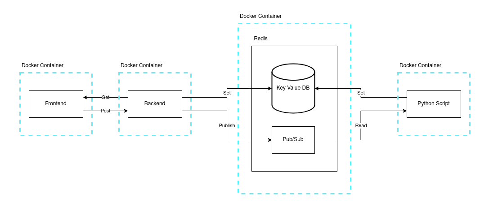
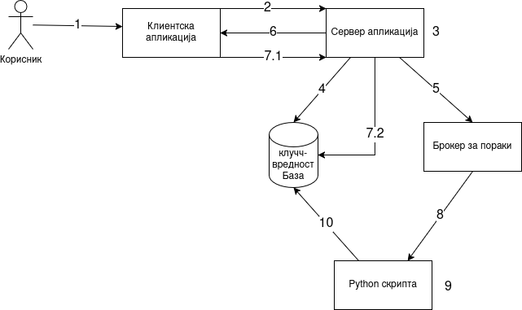

An [online-compiler](http://64.226.66.193:3000/) for my programming language [Shijak](https://github.com/Shijakov/Shijak-Compiler)

# Architecture

The web applications has the following components:
- React front-end application
- Laravel back-end application
- Redis key-value db and Redis message broker
- Python script that executes the code

# Execution Flow

1. The user clicks the __Compile__ button.
2. The client application sends a __POST__ request to the server.
3. The server generates a unique __ID__ for this execution instance of the Shijak program.
4. The server stores an entry in the database with key __ID__ and value `{status: "waiting"}`.
5. The server publishes a message to the message broker: `{id: ID, code: CODE, input: INPUT}`.
6. The server responds to the client’s __POST__ request with the generated __ID__.
7. From this point, the following two steps are repeated every second until the execution of the Shijak program is complete (i.e., until the client receives `{status: "done", ...}`):
 - Using the received __ID__, the client sends a __GET__ request to check the execution status of the Shijak program.
 - The server retrieves the current value from the database for the given __ID__ and returns it to the client.
8. A Python script listening to the message broker receives the message, extracts the __CODE__ and __INPUT__, and starts executing the code.
9. The Python script first invokes the Shijak compiler with __CODE__, then executes the output with the MARS simulator using the provided __INPUT__.
10. The result of the execution is stored in the database. Specifically, the server updates the entry for __ID__ with `{status: "done", message: MESSAGE}`. If the compiler throws an error, the error is recorded instead.
11. Finally, the two steps under 7. are executed once more. When the client receives `{status: "done", message: MESSAGE}`, it displays __MESSAGE__ on the screen, completing the execution workflow.
